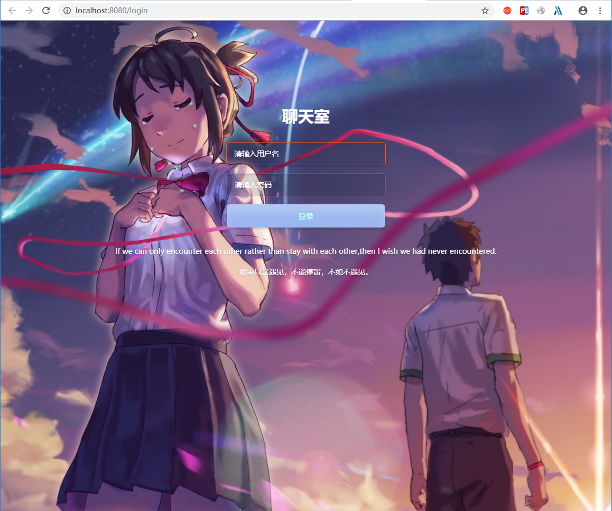
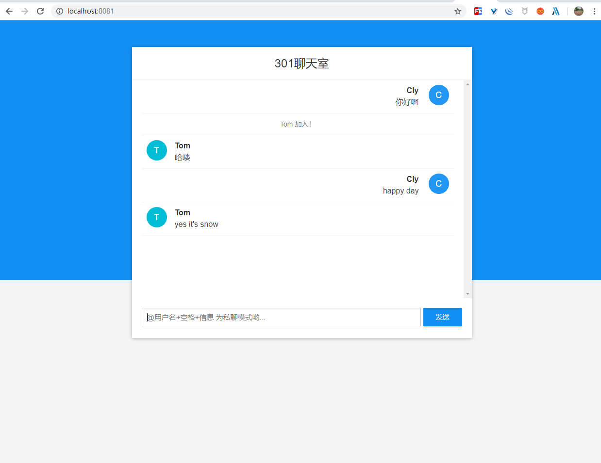

# rabbitmq_websocket
当前为 JWT 整合版  
SpringBoot2.0 整合 RabbitMQ 消息队列示例  
Spring WebSocket 使用 RabbitMQ 作为消息代理 启用 Stomp 完成简单的聊天功能。  
该功能与master分支版本基本一致，只是采用了jwt来取代session。  
由于采用了JWT模式 所以登录的时候需要手动访问登录页面地址。  
该分支主要演示jwt模式，所以功能部分很简单。  
项目截图：  
  
  