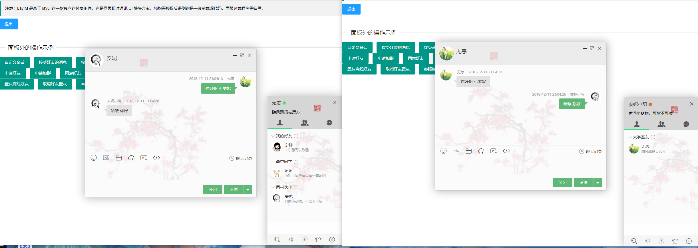

# rabbitmq_websocket
SpringBoot2.0 整合 RabbitMQ 消息队列示例  
Spring WebSocket 使用 RabbitMQ 作为消息代理 启用 Stomp 完成简单的聊天功能。

## 当前master分支主要为自己学习rabbitmq消息队列功能，大部分功能在代码中有写注释用法功能。  
## 当前master版用户登录用的是session机制，jwt机制请查看 jwt 分支。    
## 若想查看聊天版 请将分支切换到 layIM，该分支专注于聊天，用了贤心大神的layIM.
  
  想自己本地运行的请执行以下几个步骤：
1. 下载完该项目需执行根目录下的 chat.sql  
2. 由于配置了reids，所以需要启动reids。若嫌麻烦当前分支也可以自行改配置去掉mysql及redis，  
因为当前分支以学习rabbitmq 消息队列功能为主，redis和mysql在业务上并未用到。  
3. 同时需要下载 rabbitmq 并安装，该过程自行百度或谷歌  
4. 安装完成并且配好rabbitmq环境变量后，还需开启stomp插件功能，开启命令为：  
``rabbitmq-plugins enable rabbitmq_web_stomp``
5. 以上过程完成后直接在idea中运行该项目，用户名和密码配置在WebSecurityConfig.java中，  
可自行修改，请用两个浏览器登陆不同号，然后就可以愉快进行简单的对话了。  
配置的三个用户名：Cly , Jack , Tom  密码统一为：123456  

项目截图：  

  
